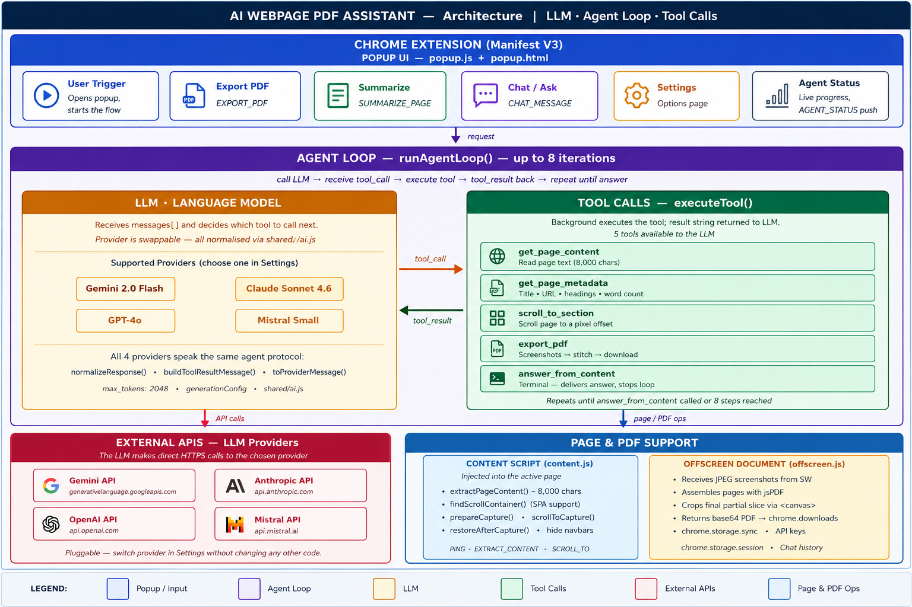

# AI Webpage PDF Assistant — Chrome Extension

A Manifest V3 Chrome extension that acts as an **LLM agent inside the browser**.  
Ask it anything about the current page, export a pixel-perfect full-page PDF, or get an AI-generated summary — all without a backend server.

---

## Architecture



> Full schema details, message contracts, and pipeline docs: **[SCHEMA.md](SCHEMA.md)**

### How the agent loop works

```
User types: "Give me a summary and PDF of this page"
          │
          ▼
    Popup UI  →  sendMessage(CHAT_MESSAGE)
          │
          ▼
  Background Service Worker
    └─ AGENT LOOP  (max 8 iterations)
         │
         ├─ LLM called  ──────────────────────────►  Gemini / Claude / GPT-4o / Mistral
         │  ◄── tool_call: export_pdf ─────────────  LLM decides which tool to call
         │
         ├─ executeTool("export_pdf")
         │     └─ scroll page → captureVisibleTab → jsPDF → chrome.downloads
         │
         ├─ LLM called  ──────────────────────────►  LLM
         │  ◄── tool_call: get_page_content ──────  reads page text
         │
         ├─ executeTool("get_page_content")
         │     └─ content script extracts DOM text (8k chars)
         │
         ├─ LLM called  ──────────────────────────►  LLM
         │  ◄── tool_call: answer_from_content ───  final answer, stops loop
         │
         └─ reply shown in Chat panel  ✓  PDF already in Downloads  ✓
```

---

## Features

| Feature | How it works |
|---|---|
| **Full-page PDF** | Scroll-capture screenshots, stitch with jsPDF in offscreen document |
| **AI Summary** | Agent reads page content, returns structured markdown (TL;DR + key points) |
| **Chat about the page** | Multi-turn conversation; history kept per-tab in `chrome.storage.session` |
| **Multi-provider** | Gemini, Claude, GPT-4o, Mistral — switchable in Settings |
| **SPA support** | `findScrollContainer()` detects custom scroll divs (ChatGPT, Notion, etc.) |

---

## Quick Start

### 1. Load the extension

1. Open `chrome://extensions`
2. Enable **Developer mode** (top right)
3. Click **Load unpacked** → select this folder

### 2. Add your API key

Click the **⚙ Settings** button in the popup (or visit `chrome://extensions` → Details → Extension options) and enter your key for the chosen provider:

| Provider | Get a key |
|---|---|
| Google Gemini | https://aistudio.google.com/app/apikey |
| Anthropic Claude | https://console.anthropic.com/settings/keys |
| OpenAI GPT-4o | https://platform.openai.com/api-keys |
| Mistral AI | https://console.mistral.ai/ |

Keys are stored in `chrome.storage.sync` (local + syncs across your signed-in Chrome devices). They are never sent anywhere except the chosen provider's API.

### 3. Use it

- **Export PDF** — click the button; the PDF downloads automatically
- **Generate Summary** — click to run the agent and get a structured markdown summary
- **Chat** — type anything: _"What are the key arguments?"_ or _"I want a PDF and summary"_

---

## Project Structure

```
chrome_plugin_pdf/
├── manifest.json          MV3 manifest
├── background/background.js   Service worker — agent loop, PDF export
├── content/content.js         Injected into pages — DOM, scroll, capture helpers
├── popup/                     Toolbar popup UI
├── options/                   API key settings page
├── offscreen/                 jsPDF stitching (needs DOM, can't run in SW)
├── shared/ai.js               LLM clients + tool definitions + normalizers
├── lib/jspdf.umd.min.js       Bundled locally — no CDN dependency
├── architecture.png           Architecture diagram (1920×1080)
└── SCHEMA.md                  Message contracts, storage schema, tool reference
```

---

## Tools Available to the LLM

Defined in [`shared/ai.js`](shared/ai.js), translated to each provider's format automatically.

| Tool | What it does |
|---|---|
| `get_page_content` | Returns cleaned page text (8,000 char limit) |
| `get_page_metadata` | Returns title, URL, headings, word count (fast) |
| `scroll_to_section` | Scrolls to a pixel offset for long-page access |
| `export_pdf` | Captures full-page screenshots and downloads PDF |
| `answer_from_content` | **Terminal** — delivers final answer and ends the loop |

---

## Development Notes

- No build step required — plain ES modules with `"type": "module"` in the service worker
- Reload the extension at `chrome://extensions` after editing any file
- Inspect layers:
  - **Popup**: right-click popup → Inspect
  - **Service worker**: `chrome://extensions` → "Inspect views: Service Worker"
  - **Content script**: DevTools on target page → Console (filter by extension origin)
- `captureVisibleTab` is rate-limited to **2 calls/second**; the capture loop enforces ≥650 ms/screen
- Test the agent on `chrome://` pages — it will fail gracefully (content script can't inject there)

---

## Testing API Key (Python helper)

```bash
pip install google-generativeai   # or anthropic / openai
python test_gemini_key.py
```

- **Valid key** — confirms the key works and shows available models
- **Quota exceeded** — key is valid but you've hit free-tier rate limits
- **Not found / Invalid** — authentication failed

---

## License

MIT
